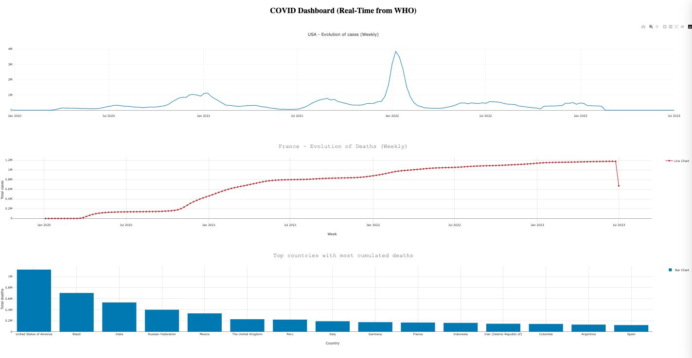

# 🤔 Problem

Keeping track of Covid related data is painful. The raw data is provided by the WHO (World Health Organization). It is a CSV with hundreds of thousands of rows and hundreds of columns. In order to gather insights, you'd have to do a lot of tedious excel work.

 

# 💡 Solution

This project is scrapping the Covid data from the WHO data sources, crunching it to generate interesting insights and comparisons across countries (stored in a Bigquery database). Then displaying it on beautiful dashboards (using Metabase).

 

# 🤖 Stack overview

- Python
- Pandas: for data manipulation and package definition.
- Matplotlib and Seaborn: for pre-visualization in Jupyter Notebook.
- Google Bigquery: to create the databases.
- Metabase: to visualize the data.
- REST Countries API: to get basic country information.

**COVID-19 Open Data**: Covid-19 dataset created by Google. Not updated since September 15th 2022 - but scripts re-used and adapted for this project.

 

# 🪜 Project steps

## 1. 💽 Data collection

We first looked at Google COVID-19 Open-Data (see [here](https://github.com/GoogleCloudPlatform/covid-19-open-data)). It is a very comprehensive project, unfortunately the scripts written by the community to gather data from each national health ministries were not up to date. Contributions stopped on September 13th 2022 and the repository was turned read-only.

Main data sources:
- For cases and deaths: https://data.humdata.org/dataset/coronavirus-covid-19-cases-and-deaths
- For vaccines: https://data.humdata.org/dataset/covid-19-vaccinations

We have a script with cron-job that picks up the raw CSV data from the WHO (World Health Organization).

## 2. 🧱 Data consolidation and functions definitions

We used Pandas in Jupyter Notebook to explore the data and build aggregation functions on the raw dataset.

The whole logic was then packaged so we can generate the data we need to feed to Tableau.

A total of xxx functions were created across xxx packages.

## 3. ⏳ Data flow

1. We have a CRON job scheduled to pick up the two main csv files from the WHO website every single day at 12:00

2. The different packages then run to generate the consolidated data. Each visualization source is under a separate database.

3. We query the Bigquery database with SQL and display the data on a dashboard using the Dash by Plotly framework (served using Render)

## 4. 📊 Data visualization setup

We use the following types of charts to display our insights:
- Line charts
- Bar charts
- Pie charts

Moving forward, you can set a dashboard that connects to BigQuery using two approaches:

1. Paid but fast 👉 setup a Metabase instance using a service like Render. You will have to pay as Render free tier is not sufficient to host a Metabase instance. You will have to pay ~$25 / month to have your own instance on Render. You can also use Metabase cloud but that will be minimum $85 / month.

2. Free but slow 👉 use Dash by Plotly to create your own custom dashboard. This is light so you can definitely host that on a Render instance using their free tier.

I made a quick demo using Dash by Plotly so you see what it is capable of. It's a light dashboard and a lot more time could be spent in order to make it more comprehensive and prettier looking.

## Conclusion

Overall, this project can be used as a boiler plate for the following flow:
1. Picking data from a CSV on any website using a CRON job in the cloud (Google Cloud Scheduler)
2. Apply a bunch of data preprocessing steps using Python scripts
3. Push the resulting Panda dataframes to a Bigquery database
4. Query the data with SQL
5. Display it on a web page using Dash by Plotly
